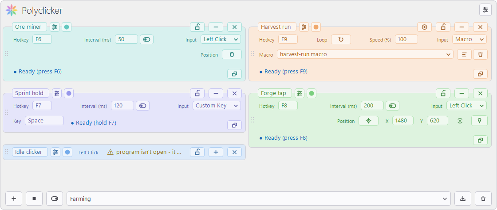
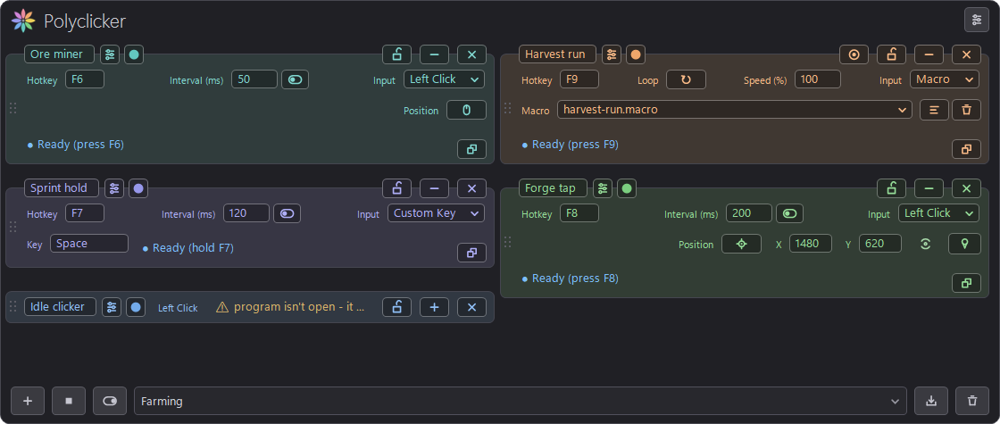

#  Polyclicker

Auto-clicker and macro recorder for Windows. Record real mouse and keyboard
input and replay it on a loop, or run any number of independent clickers at
once, each with its own hotkey, interval, and target window. Single exe, no
installer.





## Features

- Macro recorder: capture a timeline of mouse and keyboard input, replay it
  looped, optionally positioned relative to the target window
- Any number of clicker cards, each with its own hotkey (toggle or hold),
  interval, and settings
- Background clicking: a card tied to a window can click it without focusing
  it
- Per-window hotkeys: a gated card's key only fires in its window and types
  normally everywhere else
- Left/right/middle/X1/X2 click, a custom key, or a recorded macro
- Timing jitter, position jitter, per-click hold duration
- Stop after N clicks or N seconds, or on any real input
- Profiles, kill switch, tray icon, dark/light theme
- One thread per running clicker, paced off the high-resolution performance
  counter and waiting on a kernel timer rather than spinning
- ~290 KB exe, no dependencies beyond the .NET Framework included in
  Windows, no installer or background service; settings are an INI file

## Download

Get `Polyclicker.exe` from the [latest release](../../releases/latest).
Settings are stored in `%APPDATA%\Polyclicker` (set the `POLYCLICKER_DATA`
environment variable to relocate them, e.g. for a portable install).
A session log (`log.txt`) is written to the same folder.

The exe is unsigned, so SmartScreen or antivirus may warn on first run. If
you'd rather not trust a downloaded binary, build it yourself:

## Build

No SDK or NuGet needed; the compiler ships with the .NET Framework:

```powershell
.\build.ps1
```

or directly:

```
C:\Windows\Microsoft.NET\Framework64\v4.0.30319\csc.exe /nologo /optimize+
    /target:winexe /out:Polyclicker.exe *.cs
    /r:System.dll /r:System.Drawing.dll /r:System.Windows.Forms.dll
```

Requires .NET Framework 4.x (included in Windows 8 and later).

## License

[MIT](LICENSE)

## Disclosure

A large share of this code was written by an AI assistant, with a human
directing, reviewing, and testing it. I'm Sorry. Review the source before
trusting the binary. This program installs system-wide keyboard and mouse
hooks and synthesizes input; a bug could swallow keystrokes or leave a mouse
button logically held down. Avoid running it in situations where unintended
clicks could cause harm. Provided as-is, without warranty.
